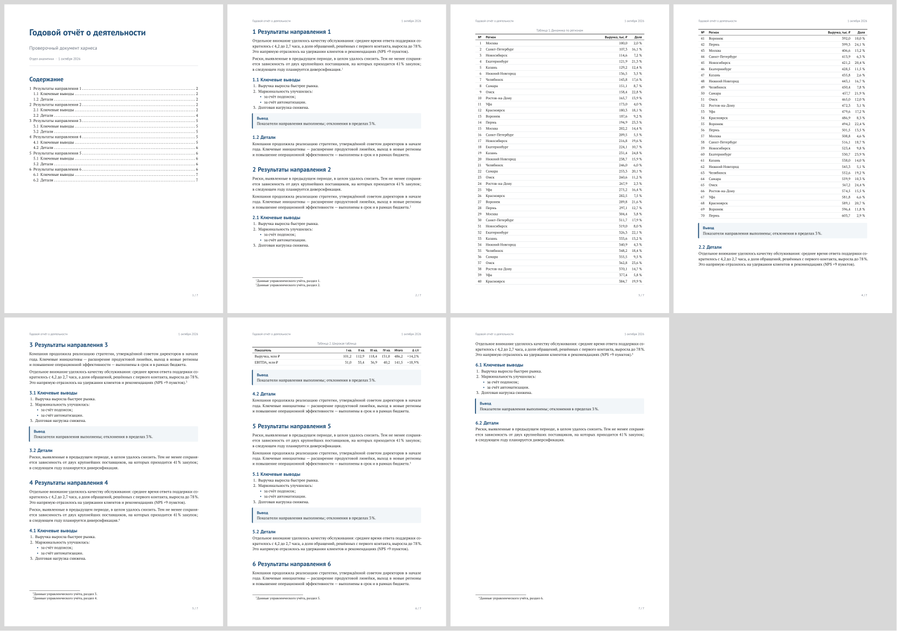
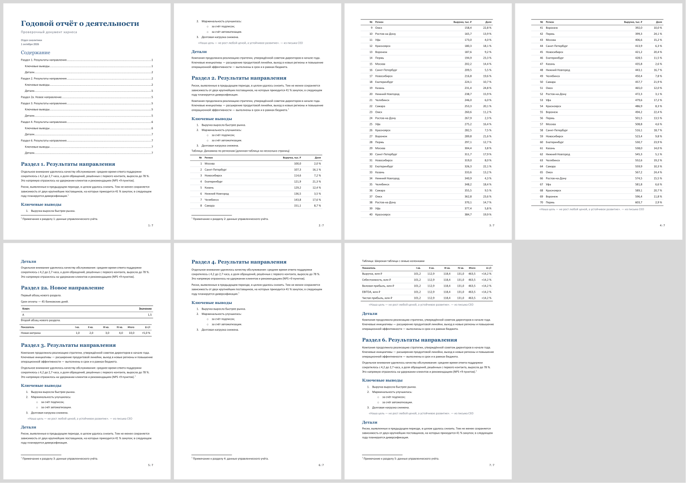

# docs-harness

Harness for AI coding agents (Claude Code, Codex, Cursor, …) that **create beautiful DOCX/PDF documents
and make careful, format-preserving edits to existing ones** — with a layout gate so the output never
ships with broken pagination.

Харнес для ИИ-агентов: красивые DOCX/PDF с нуля и аккуратные правки существующих документов
(текст, блоки, разделы, таблицы, track changes) с обязательной проверкой вёрстки.

| New PDF (Typst template) | Existing DOCX after block edits |
|---|---|
|  |  |

## What's inside

| | |
|---|---|
| `tools/qa.py` | **Layout gate** (exit 1 on error): overprinted text, overflow past margins, tables orphaned at a page bottom, stranded headings, blank pages, empty TOC, font substitution / non-embedded fonts / missing glyphs, leftover placeholders; with `--original`: pixel + text diff proving nothing moved outside the edit |
| `tools/render.py` | any `.docx/.typ/.html/.pdf` → PDF + page PNGs + one contact sheet (DOCX via LibreOffice UNO with TOC/field refresh) |
| `tools/docx_edit.py` | edit existing DOCX by **blocks**: insert/delete/move paragraphs, headings, list items, tables, whole sections; rewrite text; table rows, **columns**, merged cells; **formatting** (fonts, colours, fills, alignment — only what you name changes); **pictures** (insert, replace, resize); minimal-diff replace across runs; optionally as **tracked changes**; new content is cloned from existing blocks so it inherits the document's own styles, numbering and fonts |
| `tools/docx_kit.py` | house-style DOCX: `reference.docx` from design tokens, booktabs tables, TOC, Markdown → DOCX via pandoc |
| `tools/pdf_edit.py` | in-place PDF text replacement with the embedded font, same size/colour/baseline; refuses edits that would overflow |
| `tools/pdf_flow.py` | **structural edits inside a PDF with no source**: add / delete table rows, rewrite a cell, delete a block, insert a paragraph or picture. Everything below the edit moves as one unit, crossing rules stretch, new text is set in the document's own font; every edit is proven by a pixel comparison of the untouched regions |
| `tools/pdf_objects.py` | transactional PDF object/page ops: insert text, images, tables into a verified empty area; duplicate/delete/rotate pages |
| `tools/host.py` | finds LibreOffice, pandoc and fonts on Windows, macOS and Linux |
| `tools/safe_output.py` | atomic output: results are validated in a temp file before replacing the target |
| `templates/report.typ` | Typst design system: Russian typography (non-breaking spaces, hyphenation), booktabs tables, headers/footers |
| `tests/` | `validate.py` end-to-end on complex documents + a real arXiv paper; `features.py`, `regression.py`, `torture.py`, `randomized.py`; `corpus.py` / `pdf_corpus.py` sweep the editors over hundreds of real-world DOCX / PDF files (Apache POI, pandoc, pdf.js, arXiv) — a refusal is fine, a crash or a corrupted file is not |
| `AGENTS.md` | the rules agents follow (Claude Code reads it via `CLAUDE.md`) |

## Setup (Windows, macOS, Linux)

```bash
pip install -r requirements.txt
# LibreOffice + pandoc:
winget install -e --id TheDocumentFoundation.LibreOffice && winget install -e --id JohnMacFarlane.Pandoc   # Windows
brew install --cask libreoffice && brew install pandoc                                                     # macOS
sudo apt install libreoffice python3-uno pandoc                                                            # Linux
uv tool install adeu          # optional: redlines with comments
python tools/host.py          # what was found on this machine
python tests/features.py && python tests/validate.py      # -> OK / ALL GREEN
```

## Quick start

```bash
python tools/qa.py examples/report.typ                       # build + gate a PDF report
python tools/docx_kit.py md notes.md out/notes.docx --toc    # Markdown -> styled DOCX
python tools/docx_edit.py in.docx --blocks                   # outline of an existing document
python tools/docx_edit.py in.docx out.docx --ops ops.json --track "Reviewer"
python tools/qa.py out.docx --original in.docx --allow-reflow
python tools/pdf_flow.py in.pdf --rows                       # rows of a PDF as the eye sees them
python tools/pdf_flow.py in.pdf out.pdf --ops pdf_ops.json   # e.g. [{"op":"add_row","page":2,"after":"Total","values":["New","1,0"]}]
```

`ops.json` example:

```json
[
  {"op": "insert", "before": "3. Results", "like": "1. Introduction", "text": "2a. New section"},
  {"op": "insert_table", "after": "2a. New section", "like": "Revenue", "rows": [["Metric", "Q1"], ["Users", "1,2"]]},
  {"op": "delete_section", "heading": "5. Appendix"},
  {"op": "replace", "find": "within 30 days", "replace": "within 45 days"},
  {"op": "add_col", "table": "Revenue", "after": -1, "values": ["2027", "1,4", "2,1"]},
  {"op": "format", "table": "Revenue", "row": 0, "fill": "1F4E79", "color": "FFFFFF"},
  {"op": "insert_image", "after": "Figure 1", "file": "chart.png", "width_cm": 12}
]
```

See [AGENTS.md](AGENTS.md) for the full workflow, op reference and QA fix-ups.

## Built on

[Typst](https://typst.app) · [python-docx](https://github.com/python-openxml/python-docx) ·
[PyMuPDF](https://github.com/pymupdf/PyMuPDF) · [pandoc](https://pandoc.org) · [LibreOffice](https://www.libreoffice.org) ·
[adeu](https://github.com/dealfluence/adeu) · fonts: PT Serif / PT Sans (OFL).

License: MIT (fonts: OFL 1.1).
